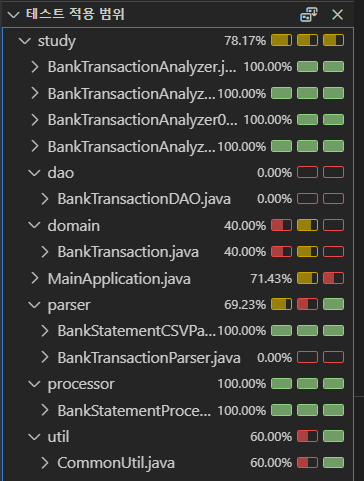

# 2장. 입출금 내역 분석기

> ...


## 진행

* [ ] 한번 읽어보기!!!

### 실행

gradle application 플러그인으로 실행할 때.. 인자를 전달하려면 다음과 같이 실행.

```bash
gradle clean run --args="bank-data-simple.csv" 
```

* https://docs.gradle.org/current/userguide/application_plugin.html#sec:application_usage


### 예제 2-1

* `src/main/resources` 경로의 입출금 내역 csv 파일을 얻을 때.. 예제 2-1에 나온대로 하면 Jar 패키징을 한뒤라면 정상동작하지 않을 것이여서, 약간 로딩 방식을 약간 바꿨음.

  ```java
    private static Path getCsvPath(String fileName) {
      URL resource = BankTransactionAnalyzerSimple.class.getResource("/" + fileName);
      try {
        return Path.of(resource.toURI());
      } catch (URISyntaxException e) {
        throw new IllegalArgumentException(e);
      }
    }
  ```

  * resource 경로의 파일을 불러오는 메서드를 별도로 만듬.


### 코드 커버리지



* VSCode에서도 커버리지로 실행하면 코드 커버리지를 볼 수 있다.


## 의견

* 잘 읽었음.👍👍👍
* 테스트 코드는 거의 모든 코드에 추가하긴 했는데... 2.11의 되새김 부분은 한번 책을 다 나가고 생각해보자! 😅


## 기타

* ...


## 정오표

* p36: 예제 2-9 소스코드
  * update 메서드와 delete의 파라미터 인자가 뒤 바뀐 것 같다.