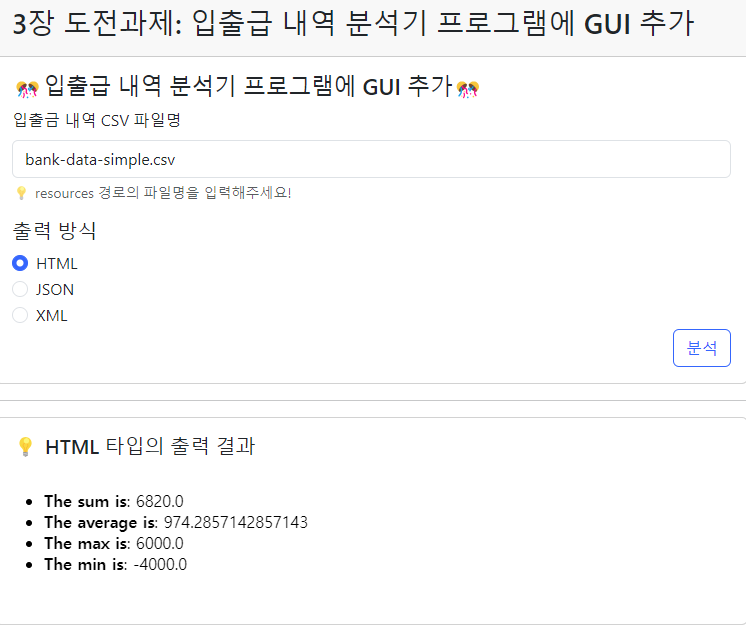
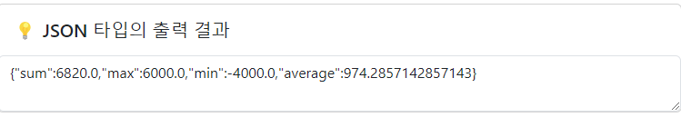
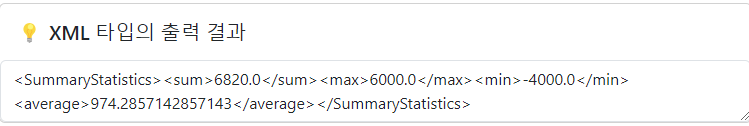

# 3장. 입출금 내역 분석기 확장판 - WEB UI

> 도전과제에 GUI를 추가해보라는 저자님 과제가 있었는데...
> 내가 Swing은 잘 모르니... Spring MVC + Thymeleaf를 사용해서 WEB UI로 추가해보자! 😅


## 진행

* [x] Web UI 개발

* 임베디드로 바로 실행하기위해 Gretty를 추가하자!
* 이제 Spring을 사용하니, new로 직접 생성한 객체들은 Bean으로 생성해도 되겠다.


### 웹 애플리케이션 실행

Gretty 플러그인을 추가했으니.. 다음 명령으로 실행하면 된다.

```bash
gradle clean appRun
```


### 실행화면

#### HTML 출력

HTML 같은 경우는 iframe에 출력된 HTML 코드가 해석되도록 했다.




### JSON / XML 출력

JSON, XML은 Jackson 라이브러리를 써서 문자열을 그대로 Text Area에다 출력했다.






## 의견

* JPA 책만 계속 보다가 Spring + Thymeleaf 프로젝트를 만들어서 하려니 생각이 잘나서 해맸다..
* 그래도 도전과제 요구사항은 준수한 것 같아 다행이다. 👍👍👍


## 기타

* ...

